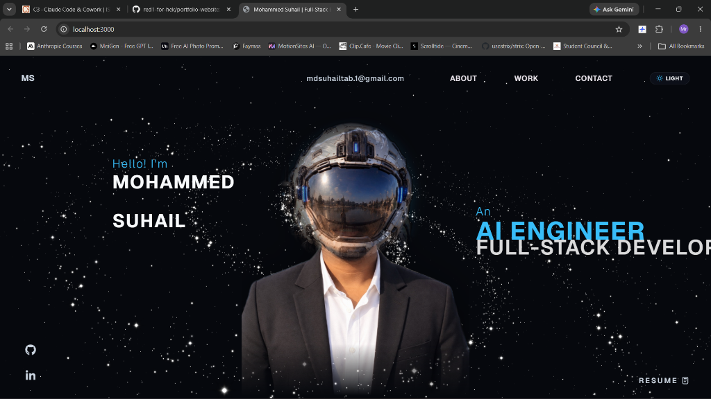
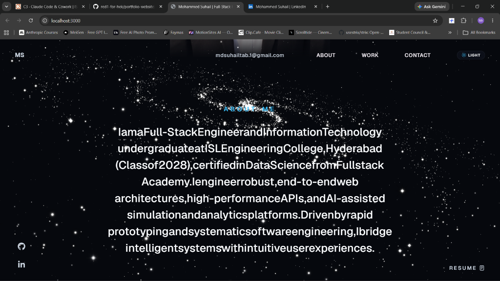

# 🌌 Mohammed Suhail — AI Engineer & Full-Stack Developer Portfolio

<div align="center">

[](https://mohammed-suhail.vercel.app/)
[](https://reactjs.org/)
[](https://www.typescriptlang.org/)
[](https://threejs.org/)
[](https://vitejs.dev/)
[](LICENSE)

<br/>

**A futuristic, cinematic 3D developer portfolio engineered with Three.js WebGL particle simulations, interactive cyborg cursor reveals, smooth scroll snapping, and a zero-scroll mobile swipe deck.**

[Explore Live Portfolio 🚀](https://mohammed-suhail.vercel.app/) • [Report Bug 🐛](https://github.com/mohammedsuhail0/portfolio/issues) • [Request Feature 💡](https://github.com/mohammedsuhail0/portfolio/issues)

</div>

---

## 📸 Visual Showcase

### 🌟 Hero Section — 3D Galaxy Canvas & Pragmata Astronaut Suit Reveal
> Symmetrically centered typographic layout flanking an interactive cursor reveal centerpiece. Hovering reveals the high-tech Pragmata astronaut exploration suit beneath realistic 3D starfield particles.

<div align="center">
  
</div>

<br/>

### 🌌 About Me — Frosted Obsidian Glassmorphism
> High-contrast cosmic glass card with 20px backdrop blur, eliminating galaxy star blending while providing ultra-clean, readable typography.

<div align="center">
  
</div>

---

## ✨ Key Architectural Highlights

- 🪐 **Realistic 3D Galaxy & Starfield**: Built with custom Three.js WebGL shaders rendering tens of thousands of stars, galactic dust, and interactive orbital depth.
- 👨‍🚀 **Pragmata Astronaut Cursor Reveal**: Dual-layer canvas blending Mohammed Suhail's authentic portrait into a futuristic deep-space astronaut suit with dynamic feathered mask cursor tracking.
- 📱 **Zero-Scroll Mobile Mode**: Strict `100dvh` viewport lock with horizontal gesture swipe cards, bottom dock navigation, and interactive app drawers — eliminating infinite mobile scrolling.
- ⚡ **GSAP & Lenis Smooth Motion Pipeline**: Kinetic text reveals, ScrollTrigger coordinate sync, and buttery smooth inertial scrolling.
- 🛡️ **Production Hardened**: 100% TypeScript type safety, tree-shaken assets, and optimized Vite production builds.

---

## 🏗️ System Design & Architecture

```
                                  +---------------------------------------+
                                  |         Browser Viewport Entry        |
                                  +---------------------------------------+
                                                      |
                                       +--------------+--------------+
                                       |                             |
                                [Screen <= 768px]             [Screen > 768px]
                                       |                             |
                                       v                             v
                       +-------------------------------+  +-----------------------------+
                       |    MobileContainer.tsx        |  |     MainContainer.tsx       |
                       |  - 100dvh Zero-Scroll Lock   |  |  - Lenis Smooth Scroll       |
                       |  - Touch Swipe Gesture Deck   |  |  - Full Page Snap           |
                       |  - Glass Bottom Dock Nav      |  |  - GSAP ScrollTrigger       |
                       +-------------------------------+  +-----------------------------+
                                       |                             |
                                       +--------------+--------------+
                                                      |
                                                      v
                                      +-------------------------------+
                                      |      Scene.tsx (Three.js)     |
                                      |  - 3D Galaxy Starfield Canvas |
                                      |  - Custom Particle Shaders    |
                                      |  - Background Orbit & Parallax|
                                      +-------------------------------+
                                                      |
                    +--------------------+------------+------------+--------------------+
                    |                    |                         |                    |
                    v                    v                         v                    v
          +-------------------+ +------------------+     +------------------+ +-------------------+
          |    Landing.tsx    | |    About.tsx     |     |   WhatIDo.tsx    | |    Career.tsx     |
          | - Centered Layout | | - Obsidian Glass |     | - Core Skillsets | | - Certifications  |
          | - RevealHeroFace  | | - High Contrast  |     | - Bento Grid     | | - Hackathons      |
          +-------------------+ +------------------+     +------------------+ +-------------------+
                    |                    |                         |                    |
                    +--------------------+------------+------------+--------------------+
                                                      |
                                                      v
                                        +----------------------------+
                                        |   Work.tsx & TechStack     |
                                        | - NextPatient, ShieldSense |
                                        | - 11+ Production Apps      |
                                        | - Interactive Tech Cloud   |
                                        +----------------------------+
```

---

## 🛠️ Tech Stack & Dependencies

| Category | Technologies |
| :--- | :--- |
| **Frontend Core** | React 18, TypeScript, Vite 5 |
| **3D & Graphics** | Three.js, `@react-three/fiber`, `@react-three/drei`, GLSL Shaders |
| **Animation & Scroll** | GSAP 3.12, ScrollTrigger, Lenis Smooth Scroll |
| **Styling & Design System** | Custom CSS Variables, Glassmorphism, Geist & Bebas Fonts |
| **Icons & UI Assets** | Lucide React, Simple Icons, FontAwesome |
| **Deployment & CI/CD** | Vercel Serverless Edge, GitHub Actions |

---

## 📁 Repository Structure

```bash
portfolio/
├── api/                      # Vercel serverless edge functions
│   └── chat.js               # AI portfolio assistant API endpoint
├── public/                   # Static assets & public media
│   ├── certificates/         # IIT Bombay, FSA, Google hackathon credentials
│   ├── hackathons/           # Hackathon showcase images & trophies
│   ├── images/               # Tech icons, badges & portfolio graphics
│   ├── projects/             # High-res screenshots of production apps
│   ├── screenshots/          # Readme visual showcase previews
│   └── suhail-astronaut-transparent.png # High-res astronaut suit asset
├── src/
│   ├── components/
│   │   ├── Character/        # Three.js 3D galaxy starfield & scene
│   │   ├── mobile/           # Mobile zero-scroll swipe deck & dock
│   │   ├── styles/           # Component-scoped CSS stylesheets
│   │   ├── utils/            # GSAP animations, splitText, scroll snap
│   │   ├── About.tsx         # About section with frosted glass card
│   │   ├── Career.tsx        # Experience & credentials timeline
│   │   ├── Landing.tsx       # Symmetrically centered hero section
│   │   ├── RevealHeroFace.tsx# Cursor-tracking astronaut suit reveal
│   │   ├── TechStackNew.tsx  # Interactive skills & tools cloud
│   │   └── Work.tsx          # Featured full-stack & AI projects
│   ├── config.ts             # Developer bio, links, project database
│   ├── App.tsx               # Root application router
│   └── main.tsx              # React DOM entrypoint
├── index.html                # HTML5 shell with preloaded fonts
├── vercel.json               # Vercel SPA routing & security headers
└── vite.config.ts            # Vite bundler build optimization
```

---

## 🚀 Getting Started Locally

### Prerequisites
- Node.js `18.x` or higher
- npm or yarn or pnpm

### Installation
```bash
# Clone the repository
git clone https://github.com/mohammedsuhail0/portfolio.git

# Navigate into the project directory
cd portfolio

# Install dependencies
npm install

# Start development server
npm run dev
```

Visit **`http://localhost:3000`** in your browser.

### Production Build
```bash
# Type check and generate production bundle
npm run build

# Preview production build locally
npm run preview
```

---

## 🌐 Deployment to Vercel

This repository is preconfigured for automatic continuous deployment with Vercel:

1. Connect your repository to [Vercel](https://vercel.com).
2. Set Build Command: `npm run build`
3. Set Output Directory: `dist`
4. Deploy! Any push to `main` triggers an automatic preview and production deployment.

---

## 👨‍💻 Author

**Mohammed Suhail**
- 🌐 Portfolio: [mohammed-suhail.vercel.app](https://mohammed-suhail.vercel.app/)
- 💼 LinkedIn: [linkedin.com/in/mohammed-suhail](https://linkedin.com)
- 🐙 GitHub: [@mohammedsuhail0](https://github.com/mohammedsuhail0)
- 📧 Email: [mdsuhailtab.1@gmail.com](mailto:mdsuhailtab.1@gmail.com)

---

## 📄 License

This project is open-source under the [MIT License](LICENSE).
Feel free to star ⭐ the repository if you found it inspiring!
